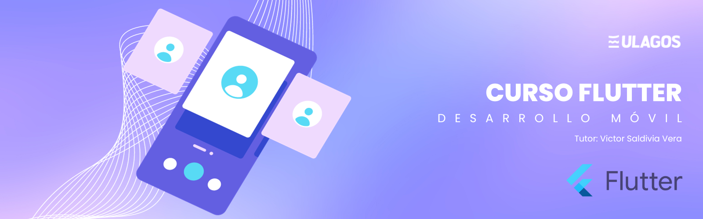

# Repositorio de Flutter

   
   

# AppCat (¡App para Empezar en el Mundo de Flutter!)

Bienvenido/a al repositorio de la App de aprendizaje en Flutter!

Este proyecto tiene como objetivo brindar una guía progresiva para estudiantes que desean aprender a desarrollar aplicaciones en Flutter. A lo largo del curso, se agregarán widgets nuevos para proporcionar una experiencia de aprendizaje continua y práctica.

---

## Estructura del Proyecto

El repositorio está organizado de manera modular para facilitar la comprensión y el seguimiento. Cada interface nueva se introducirá en el directorio lib (lib/nombre-de-la-interface) para que los estudiantes puedan enfocarse en aspectos específicos del desarrollo de la aplicación.

---

## Contenido del Curso

En este curso se verán los siguientes tópicos:

- Fundamentos de Flutter:
        Estructura de un proyecto Flutter
        Widgets básicos y composición
        Navegación entre pantallas

- Interactividad y Estado:
        Manejo de eventos
        Actualización de estado
        Animaciones simples

- Persistencia de Datos:
        Uso de almacenamiento local
        Integración de bases de datos

- Construcción de UI:
        Personalización avanzada de widgets
        Diseño responsive

- Integración de API:
        Consumo de servicios web
        Manejo de datos JSON

---

## Empezando con nuestra Aplicación

Este proyecto es un punto de partida para empezar en el mundo de Flutter.

Algunos recursos para comenzar si este es tu primer proyecto Flutter:

- [Tutorial: Escribe tu primera aplicación Flutter](https://docs.flutter.dev/get-started/codelab)
- [Cookbook: Ejemplos Útiles de Flutter](https://docs.flutter.dev/cookbook)

Para mayor información para empezar con el desarrollo Flutter, consulta la
[online documentation](https://docs.flutter.dev/), que ofrece tutoriales,
ejemplos, orientación sobre el desarrollo móvil y una referencia completa de la API.
